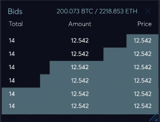
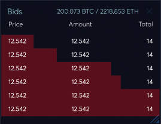
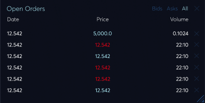

### /v2/orders
---
##### ***POST***
**Summary:** Create a Sell/Buy order.

**Description:** Create a Sell/Buy order.

**Parameters**

| Name | Located in | Description | Required | Schema |
| ---- | ---------- | ----------- | -------- | ---- |
| market | formData | Unique market id. It's always in the form of xxxyyy, where xxx is the base currency code, yyy is the quote currency code, e.g. 'btcusd'. All available markets can be found at /api/v2/markets. | Yes | string |
| side | formData | Either 'sell' or 'buy'. | Yes | string |
| volume | formData | The amount user want to sell/buy. An order could be partially executed, e.g. an order sell 5 btc can be matched with a buy 3 btc order, left 2 btc to be sold; in this case the order's volume would be '5.0', its remaining_volume would be '2.0', its executed volume is '3.0'. | Yes | string |
| price | formData | Price for each unit. e.g. If you want to sell/buy 1 btc at 3000 usd, the price is '3000.0' | No | string |
| ord_type | formData |  | No | string |

**Responses**

| Code | Description |
| ---- | ----------- |
| 201 | Create a Sell/Buy order. |

**Response Body**

## Order

| Name | Type | Description | Required |
| ---- | ---- | ----------- | -------- |
| id | string | Unique order id. | No |
| side | string | Either 'sell' or 'buy'. | No |
| ord_type | string | Type of order, either 'limit' or 'market'. | No |
| price | string | Price for each unit. e.g. If you want to sell/buy 1 btc at 3000 usd, the price is '3000.0' | No |
| avg_price | string | Average execution price, average of price in trades. | No |
| state | string | One of 'wait', 'done', or 'cancel'. An order in 'wait' is an active order, waiting fulfillment; a 'done' order is an order fulfilled; 'cancel' means the order has been canceled. | No |
| market | string | The market in which the order is placed, e.g. 'btcusd'. All available markets can be found at /api/v2/markets. | No |
| created_at | string | Order create time in iso8601 format. | No |
| volume | string | The amount user want to sell/buy. An order could be partially executed, e.g. an order sell 5 btc can be matched with a buy 3 btc order, left 2 btc to be sold; in this case the order's volume would be '5.0', its remaining_volume would be '2.0', its executed volume is '3.0'. | No |
| remaining_volume | string | The remaining volume, see 'volume'. | No |
| executed_volume | string | The executed volume, see 'volume'. | No |
| trades_count | string |  | No |
| trades | string |  | No |

---

### /v2/order_book
---
##### ***GET***
**Description:** Get the order book of specified market.

**Parameters**

| Name | Located in | Description | Required | Schema |
| ---- | ---------- | ----------- | -------- | ---- |
| market | query | Unique market id. It's always in the form of xxxyyy, where xxx is the base currency code, yyy is the quote currency code, e.g. 'btcusd'. All available markets can be found at /api/v2/markets. | Yes | string |
| asks_limit | query | Limit the number of returned sell orders. Default to 20. | No | integer |
| bids_limit | query | Limit the number of returned buy orders. Default to 20. | No | integer |

**Responses**

| Code | Description |
| ---- | ----------- |
| 200 | Get the order book of specified market. |

**Body**

### OrderBook  

| Name | Type | Description | Required |
| ---- | ---- | ----------- | -------- |
| asks | [Order](#order) |  | No |
| bids | [Order](#order) |  | No |

**Body**

##### ***GET***

**Description:** Get your orders, results is paginated.

**Parameters**

| Name | Located in | Description | Required | Schema |
| ---- | ---------- | ----------- | -------- | ---- |
| market | query | Unique market id. It's always in the form of xxxyyy, where xxx is the base currency code, yyy is the quote currency code, e.g. 'btcusd'. All available markets can be found at /api/v2/markets. | Yes | string |
| state | query | Filter order by state, default to 'wait' (active orders). | No | string |
| limit | query | Limit the number of returned orders, default to 100. | No | integer |
| page | query | Specify the page of paginated results. | No | integer |
| order_by | query | If set, returned orders will be sorted in specific order, default to 'asc'. | No | string |

**Responses**

| Code | Description |
| ---- | ----------- |
| 200 | Get your orders, results is paginated. |

**Body**

[Order](#order)
