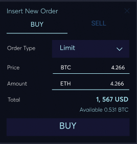

### /v2/orders
---
##### ***POST***
**Summary:** Create a Sell/Buy order.

**Description:** Create a Sell/Buy order.

**Parameters**

| Name | Located in | Description | Required | Schema |
| ---- | ---------- | ----------- | -------- | ---- |
| market | formData | Unique market id. It's always in the form of xxxyyy, where xxx is the base currency code, yyy is the quote currency code, e.g. 'btcusd'. All available markets can be found at /api/v2/markets. | Yes | string |
| side | formData | Either 'sell' or 'buy'. | Yes | string |
| volume | formData | The amount user want to sell/buy. An order could be partially executed, e.g. an order sell 5 btc can be matched with a buy 3 btc order, left 2 btc to be sold; in this case the order's volume would be '5.0', its remaining_volume would be '2.0', its executed volume is '3.0'. | Yes | string |
| price | formData | Price for each unit. e.g. If you want to sell/buy 1 btc at 3000 usd, the price is '3000.0' | No | string |
| ord_type | formData |  | No | string |

**Responses**

| Code | Description |
| ---- | ----------- |
| 201 | Create a Sell/Buy order. |